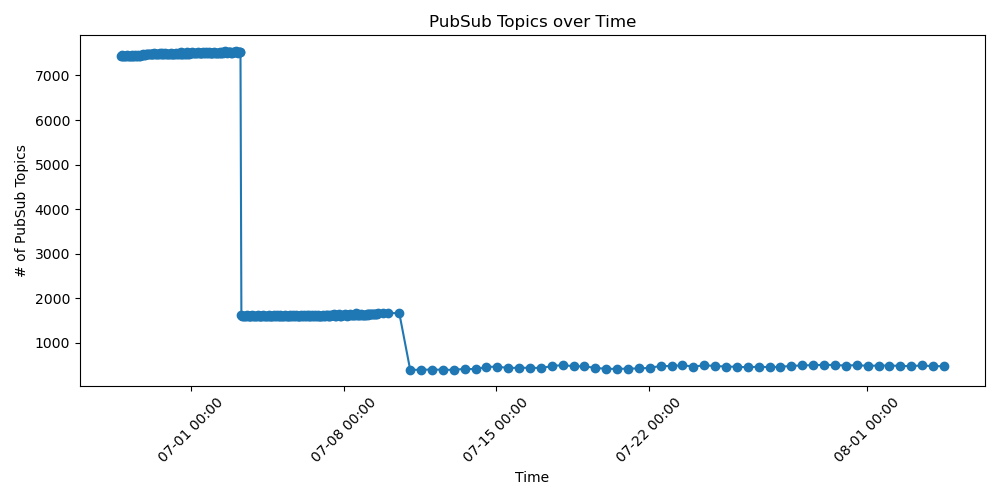

# GSoC 2025 -  Infrastructure Automation and Cloud Resource Management for Apache Beam - Final Work Submission Report

- **NAME**: Enrique Job Calderón Olalde
- **ORGANIZATION**: Apache Software Foundation
- **SUB-ORGANIZATION**: Apache Beam
- **PROGRAM**: https://summerofcode.withgoogle.com/programs/2025/projects/QRKMhW67

## AIM

The aim of this project is to enhance the infrastructure automation and cloud resource management for Apache Beam. This is achieved by implementing a set of tools and processes for managing GCP resources, including a resource cleaner, access control using Git, key rotation for GCP services, a stateless infrastructure, and automated security monitoring.

## Project Summary

This project delivers a comprehensive suite of tools to automate and secure the management of Google Cloud Platform (GCP) resources for Apache Beam. Key accomplishments include:

*   **GCP Resource Cleaner:** A Python-based tool that automatically identifies and removes stale or unused GCP resources, primarily focusing on Pub/Sub topics, to reduce costs and improve resource hygiene. The cleaner is scheduled to run periodically via a GitHub Actions workflow.

*   **GCP Access Control via Git:** A system for managing GCP Identity and Access Management (IAM) policies through a Git-based workflow. It uses Terraform to define and apply custom IAM roles, enabling a version-controlled and auditable approach to access management.

*   **Service Account Key Rotation:** A Python script that automates the rotation of GCP service account keys. It includes features for creating, disabling, and deleting keys based on a predefined schedule, enhancing the security of service account credentials.

*   **Infrastructure Enforcement:** A set of policies and tools to ensure compliance with infrastructure standards. This includes automated checks for resource configurations, as well as integration with CI/CD pipelines to enforce secure tools usage.

*   **Security Monitoring:** A log analysis tool to monitor GCP audit logs for suspicious activity. It collects and parses logs, identifies potential security threats, and is designed to integrate with alerting systems.

## Project Scope

The project encompasses five main areas of focus, each contributing to a more robust and automated cloud infrastructure for Apache Beam:

1.  **GCP Resource Cleaner:** Automated cleanup of unused GCP resources.
2.  **GCP Access Control through Git:** Management of IAM policies using a Git-based workflow.
3.  **Key Rotation for GCP Services:** Scheduled rotation of service account keys.
4.  **Infrastructure Enforcement:** Policies and tools for compliance with infrastructure standards.
5.  **Automated Security Monitoring:** Detection of policy violations and suspicious activity.

## Project Tasks

### Completed

- **GCP Resource Cleaner:**
    - Implemented a Python script to clean up stale Pub/Sub topics.
    - Created a GitHub Action to run the cleaner on a schedule.
    - Added prefixes for stale topics to the cleaner.
- **GCP Access Control:**
    - Created Terraform scripts for managing IAM roles and user permissions.
    - Mapped existing GCP users to new, more secure custom roles.
    - Added a compliance checker for IAM policies.
- **Key Rotation:**
    - Developed a Python script for rotating service account keys.
    - Implemented a compliance checker for key rotation policies.
    - Added a GitHub Action to automate key rotation.
- **Infrastructure Enforcement:**
    - Developed a set of policies for infrastructure compliance.
    - Implemented automated checks for resource configurations.
    - Integrated compliance checks into GitHub Actions.
- **Security Monitoring:**
    - Implemented a log analyzer to parse GCP audit logs for security threats.
    - Created a GitHub Action to automate the notification of potential security incidents.

### Left to Do

- **Key Rotation Automation:** The key rotation script is functional but requires it being used by the users regularly to ensure compliance with key rotation policies.
- **Security Monitoring Enhancements:** The security monitoring system should be expanded to include more comprehensive threat detection capabilities and better integration with incident response workflows.

### Future Work

- **Comprehensive Monitoring and Reporting:** A robust monitoring and reporting system should be developed to track infrastructure state, detect orphaned resources, and provide visibility into the overall health of the system.
- **Expand Security Monitoring:** The current security monitoring is focused on audit logs. This could be expanded to include other types of logs and to integrate with more advanced threat detection systems.
- **Refine IAM Policies:** The IAM policies should be regularly reviewed and refined to ensure they adhere to the principle of least privilege.
- **IAM Roles Usage**: The custom IAM roles should be monitored and analyzed for usage patterns to ensure they are being used effectively and to identify any potential security risks. This also include the migration of all the users to the new roles. (This is a work in progress by my mentor and me)

## PR Links

- [ Clean up GCP Resources (Pubsub) #34141 ](https://github.com/apache/beam/pull/34141)
- [ GCP IAM Custom Roles #35107 ](https://github.com/apache/beam/pull/35107)
- [ Stale claner implementation #35439 ](https://github.com/apache/beam/pull/35439)
- [ Set pubsup topic cleaner to run #35500 ](https://github.com/apache/beam/pull/35500)
- [ Quick fix on deleting pubsub resources #35513 ](https://github.com/apache/beam/pull/35513)
- [ Secret management service #35524 ](https://github.com/apache/beam/pull/35524)
- [ Add more Pub/Sub topic prefixes to the topic cleaner #35548 ](https://github.com/apache/beam/pull/35548)
- [ Stale pubsub subscriptions cleaner #35553 ](https://github.com/apache/beam/pull/35553)
- [ Add Terraform configuration and IAM management scripts for GCP project #35701 ](https://github.com/apache/beam/pull/35701)
- [ Add infra policy compliance checkers #35848 ](https://github.com/apache/beam/pull/35848)
- [ Infra enforcer gha #35910 ](https://github.com/apache/beam/pull/35910)
- [ Add GitHub Actions workflow for managing GCP Service Account keys #35911 ](https://github.com/apache/beam/pull/35911)
- [ Add a security GCP log analyzer #35922 ](https://github.com/apache/beam/pull/35922)

## Cool Graphs

### Pubsub Topics over Time

This graph shows the number of Pub/Sub topics over time. It can be shown that the number of topics decreased significantly in two points of time, firstly on `2025-07-03` when the GCP resource cleaner was first implemented, and secondly on `2025-07-11` when more topic prefixes were added to the cleaner.
